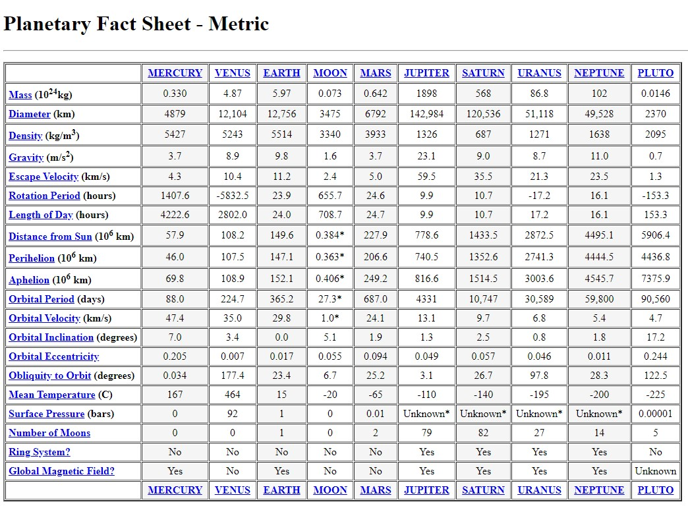

[< BACK](../README.md)

# 00.0 Research

With 3 hours as the time limit, not a lot of research can be done.  I have therefore made a few check on the API using Postman as well as digging up some API docs that would assist in the development of this prototype.

The follow information is found from a few google search and should be relatively useful.

The following pdf also outlines the image api which can be handy

[NASA Image Search API Doc](./images.nasa.gov_api_docs.pdf)

Not surprising that NASA has a version of something similar:

[Solar system](https://solarsystem.nasa.gov/planets/overview/)

#### reference

* [NASA Image Search API](https://images-api.nasa.gov/search?q=mars&media_type=image)
* [NASA Solar System Exploration](https://solarsystem.nasa.gov/planets/overview/)
* [Planet factsheet](https://nssdc.gsfc.nasa.gov/planetary/factsheet/)